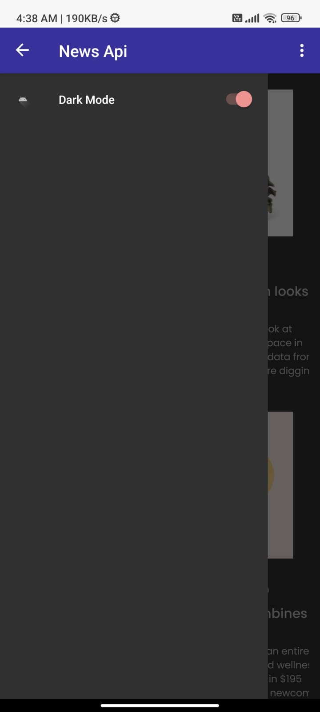
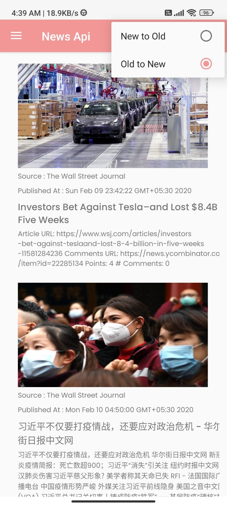
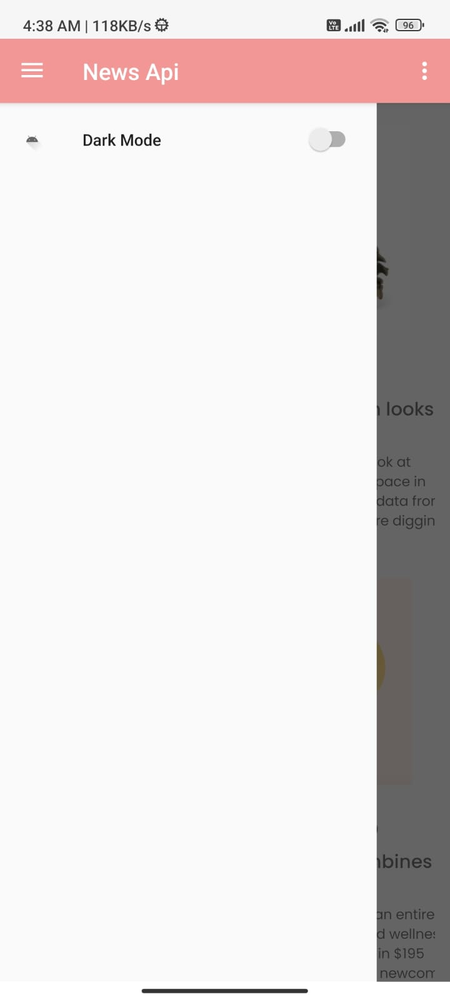
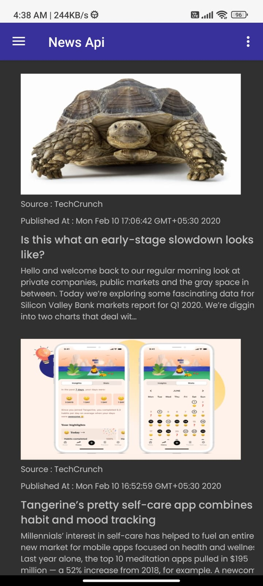
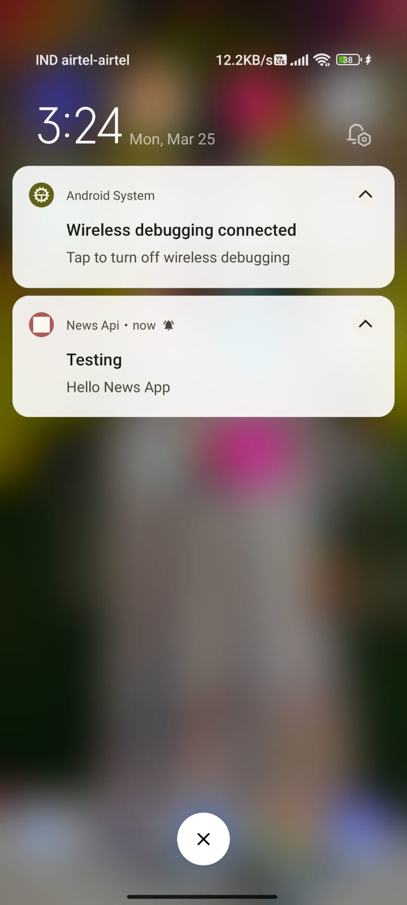

# News Api App

Welcome to the News API app! This app allows you to fetch and browse news articles from various sources.

## Steps to Run the Application

### Step 1: Download APK
- Download the APK file from the provided [Google Drive link](https://drive.google.com/file/d/1gsuYYQC-ijkDiyHoMbAWs3HH9_hzzwnA/view?usp=sharing).

### Step 2: Clone Repository
- Open your terminal or command prompt.
- Clone the repository using the following command:
- cmd> git clone https://github.com/Akash-27022002/NewsApi.git

### Step 3: Switch to Master Branch
- Navigate into the cloned directory:
- Switch to the master branch:
- cmd > git checkout master

### Step 4: Open Project in Android Studio
- Open Android Studio.
- Choose "Open an existing Android Studio project".
- Navigate to the directory where you cloned the repository and select it.

### Step 5: Run the Project
- Connect your Android device to your computer using a USB cable.
- Wait for Android Studio to recognize your device.
- Click on the "Run" button in Android Studio to build and run the application on your connected device.

### Step 6: Test the Application
- Once the application is installed on your device, you can launch it from the app drawer.
- Explore the features of the application as described in the README.md file.
- Test functionalities such as dark mode, article fetching, sorting, refreshing, and error handling.

By following these steps, you should be able to download, clone, and run the News API application on your Android device. If you encounter any issues, feel free to ask for further assistance.

## Here are some screenshots:

  
  
  
  
  

## Assumptions

In developing this News API app, several assumptions were made:

- **Assumption 1**: Users prefer a dark mode interface for better readability at night.
- **Assumption 2**: Sorting articles based on relevancy and date would improve user experience.
- **Assumption 3**: Enabling dark mode would reduce eye strain for users in low-light environments.
- **Assumption 4**: A visually appealing home screen layout would enhance user engagement.
- **Assumption 5**: Implementing Firebase push notifications would increase user retention and engagement.

## Features 

### Article Fetching
- Articles are fetched via API without using any third-party API calling library.
- Articles are listed on the home page.
- Images are displayed if they can be loaded from the URL using Glide library.
- Custom placeholder images are shown if an image fails to load from the URL.

### Sorting Option
- Sorting option is available in the right-most side of the menu icon.
- Articles can be sorted in two ways: from older to newer and newer to older.

### Push Notifications
- Implemented Firebase push notifications.
- No storage of FCM token or other user data; it's a simple implementation.
- Notifications, such as campaigns, are displayed to users when sent.

### Refreshing Articles
- Refresh option is available in the top bar.
- Allows users to refresh articles, loading new articles from the API.
- If unable to load articles due to API error or internet issues, users can reload.

### Error Handling
- If unable to load articles, a message is displayed in a TextView prompting users to reload or try again.

### In-App Browser
- Web content is loaded within the app using AndroidX browser feature.
- Custom browser tabs are used to load web content within the application.

### Dark Mode
- Implemented a switch button in the drawer layout to enable and disable dark mode.
- Users can open and close the drawer layout via the toolbar.
- 
### Architecture
- Followed the MVVM (Model-View-ViewModel) architecture pattern for better code organization and separation of concerns.

### Theme Storage
- Used Preferences to store the theme settings, allowing users to select and persist their preferred theme.

### Notification Permissions
- Implemented notification feature requires user permission to show notifications.

### Future Scope
- Implementation of bookmarking feature.
- Implementation of like and share feature to enhance user engagement.

